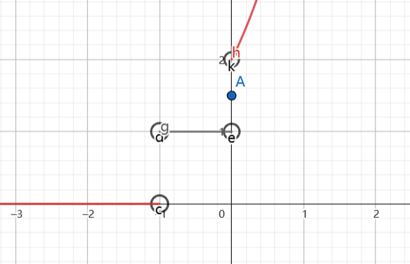

### 一.第一类间断点
### 二.第二类间断点

### 三.例题
1.设 $f(x) = \displaystyle \lim_{n\rightarrow \infty} \frac{2e^{(n+1)x} + 1}{e^{nx} + x^n + 1}$ ,求 $f(x)$ 的间断点.
解:
首先查看 $e^{nx}$ 与 $x^n$ 的极限形式
$$\begin{align}
    \lim e^{nx} = \begin{cases}
       0 ,x < 0\\
       1 ,x = 0\\
       \infty ,x > 0
    \end{cases} ,\lim x^n = \begin{cases}
        0,|x|<1 \\ 
        1, x = 1 \\
        \infty,|x|>1
    \end{cases}
\end{align}$$

则
a.$x = 0$ 时
$$\begin{align}
    \lim_{n\rightarrow \infty} \frac{2e^{(n+1)x} + 1}{e^{nx} + x^n + 1} &= \frac{3}{2}
\end{align}$$

b.$x>0$ 时
$$\begin{align}
    \lim_{n\rightarrow \infty} \frac{2e^{(n+1)x} + 1}{e^{nx} + x^n + 1} &= \lim_{n\rightarrow \infty} \frac{2e^{x} + \frac{1}{e^{nx}}}{ 1+ (\frac{x}{e^x})^n + \frac{1}{e^{nx}}} \\
    &=2e^x
\end{align}$$

c.$-1<x<0$,时
$$\begin{align}
    \lim_{n\rightarrow \infty} \frac{2e^{(n+1)x} + 1}{e^{nx} + x^n + 1} &= \frac{0 + 0 + 1}{0 + 0+ 1} \\
    &= 1
\end{align}$$

d.$x<-1$,时
$$\begin{align}
    \lim_{n\rightarrow \infty} \frac{2e^{(n+1)x} + 1}{e^{nx} + x^n + 1} &= 0
\end{align}$$

则图像为

故在 $x= -1,x=0$ 时有跳跃间断点.