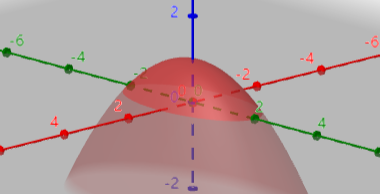

### 相关例题
1.设曲线 $\Gamma : x^2 + y^2 = 1 , y + z = 0$ ,求 $\oint_{\Gamma} zdx + y dz$
解:
解法一:
$$\begin{align}
    w = zdx + ydz \rightarrow dw = dzdx + dydz
\end{align}$$

故有

$$\begin{align}
    \oint_{\Gamma} zdx + y dz &= \iint_{\Sigma} dzdx + dydz
\end{align}$$

又因为 $\Gamma$ 所确定的曲面 $\Sigma :x^2 + y^2 \leq 1 , y + z = 1$ ,注意曲面一整个都是是在 $y = z$ 上的,可以得到 $z$ 对于 $x,y$ 的偏导数.

$$\begin{align}
    \frac{\partial z}{\partial y} = -1, \frac{\partial z}{\partial x} = 0 
\end{align}$$

故

$$\begin{align}
    \iint_{\Sigma} dzdx + dydz &= \iint_{D_{xy}} - \frac{\partial z}{\partial y} dxdy \\
    &=\iint_{D_{xy}}  dxdy \\
    &= \pi
\end{align}$$

其中 $D_{xy} = \{(x,y)| x^2 + y^2 \leq 1 \}$

解法二:
令

$$\begin{align}
    x = \cos t \\
    y = \sin t\\
    z = -\sin t
\end{align}$$

得到

$$\begin{align}
    \int^{2\pi}_0 \sin^2 t - \cos t \sin t dt &= \int^{2\pi}_0 \sin^2 t dt -\int^{2\pi}_0 \cos t \sin t t dt  \\
    &=\int^{2\pi}_0 \sin^2 t dt \\
    &=4 \int^{\frac{\pi}{2}}_0 \sin^2 t dt \\
    &= 4 \frac{1}{2} \frac{\pi}{2} \\
    &= \pi
\end{align}$$

---
2.设曲面 $\Sigma : z = 1 - x^2 - \frac{y^2}{4} ,0 \leq z \leq 1$ ,方向向外侧,求积分

$$\begin{align}
    I = \iint_{\Sigma} xz dydz + 2zydzdx + 3xy dxdy
\end{align}$$

解:
积分区域为:

记 $\Sigma':x^2 +\frac{y^2}{4} \leq 1 ,z = 0$ ,方向向下则

$$\begin{align}
    I &= \iint_{\Sigma} w \\
    &= \oiint_{\Sigma + \Sigma'} w + \iint_{-\Sigma'} w \\
    &=I_1 + I_2
\end{align}$$

分别计算, $I_2$ 的积分区域上 $z = 0 \rightarrow dz = 0$

$$\begin{align}
    I_2 &= \iint_{-\Sigma'} 3xy dxdy \\
    &=\iint_{D_{xy}} 3xy dxdy
\end{align}$$

其中 $D_{xy} = \{(x,y) | x^2 + \frac{y^2}{4} \leq 1\}$ , $D_{xy}$ 关于 $y$ 对称,则 $I_2 = 0$ .

$$\begin{align}
    I_1 &= \oiint_{\Sigma + \Sigma'} w \\
    &= \iiint_{\Omega} \partial w \\
    &=\iiint_{\Omega} z + 2z dxdydz \\
    &=3\iiint_{\Omega}z dxdydz \\
\end{align}$$

其中 $\Omega =\{(x,y,z)| x^2 + \frac{y^2}{4} \leq 1 - z , 0\leq z\leq 1\}$ ,利用先二后一法

$$\begin{align}
    I_1 &=3 \int^1_0z dz \iint_{D_{xy}} dxdy \\
    &=3\int^1_0z [2\pi(1 - z)] dz \\
    &=6\pi \int^1_0 z -z^2 dz \\
    &= \pi
\end{align}$$

故 $I = \pi$ .

---
3.设曲线 $\Gamma :\begin{cases}
    4y^2 + z^2 = 4 , z \geq 0 \\
    x = 0
\end{cases}$ ,曲面 $\Sigma$ 由曲线 $\Gamma$ 绕 $z$ 轴旋转一周所得,取上侧,求积分
$$\begin{align}
    I &= \iint_{\Sigma} \frac{x^2ydydz + y^2zdzdx + (z^2 + 1) dxdy}{\sqrt{x^2 + y^2 + \frac{z^2}{4} + 3}}
\end{align}$$

解:
设曲线上的点为 $(x,y,z)$ ,曲面上的点为 $(x_0,y_0,z_0)$ , $z$ 轴的单位法向量为 $(0,0,1)$ ,则根据曲线绕直线旋转的两个约束有
$$\begin{align}
    \begin{cases}
        (x - x_0)0 + (y - y_0)0 + (z - z_0)1 &= 0 \\
        (x - 0)^2 + (y - 0)^2 + (z - z)^2 &= (x_0 - 0)^2 + (y_0 - 0)^2 + (z_0 - z)^2
    \end{cases}
\end{align}$$

得到
$$\begin{align}
    \begin{cases}
        z = z_0 \\
        x^2 + y^2 = x_0^2 + y_0^2 
    \end{cases}
\end{align}$$

又因为 $x = 0$ ,故 $y^2 = x_0^2 + y_0^2$ ,所以最后的变换为
$$\begin{align}
    \begin{cases}
        z = z_0 \\
        y^2 = x_0^2 + y_0^2 
    \end{cases}
\end{align}$$

故居曲线约束 $4y^2 + z^2 = 4$,得到曲面 $\Sigma: 4x_0^2 + 4y_0^2 + z_0^2 = 4$ 上侧.由此得到 $x_0^2 + y_0^2 + \frac{z_0^2}{4}= 1$ ,所以积分 $I$ 可以转换
$$\begin{align}
    I &= \iint_{\Sigma} \frac{x^2ydydz + y^2zdzdx + (z^2 + 1) dxdy}{\sqrt{x^2 + y^2 + \frac{z^2}{4} + 3}} \\
    &= \frac{1}{2}\iint_{\Sigma}x^2ydydz + y^2zdzdx + (z^2 + 1) dxdy
\end{align}$$

取 $\Sigma':x^2 + y^2 \leq 1 , z = 0$ ,所以得到
$$\begin{align}
    I &= \frac{1}{2} \iint_{\Sigma}w \\
    &=\frac{1}{2} \oiint_{\Sigma + \Sigma'}w + \frac{1}{2} \iint_{-\Sigma'}w \\
    &= I_1 + I_2
\end{align}$$

其中由于  $\Sigma \cup \Sigma'$ 所包围的例题为 $x^2 + y^2 \leq 1 - \frac{z^2}{4} , 0 \leq z \leq 2$ ,可以得到
$$\begin{align}
    I_1 &= \frac{1}{2} \iiint_{\Omega} 2xy + 2yz + 2z dV \\
    &= \iiint_{\Omega} zdV \\
    &= \int^2_0 z dz \iint_{D_{xy}} dxdy \\
    &=\int^2_0\pi z(1 - \frac{z^2}{4}) dz \\
    &=\pi
\end{align}$$

而对于积分 $I_2$ ,在 $-\Sigma'$ 是向上的,所以积分符号为正,且 $z = 0 \rightarrow dz = 0$ ,得到他的投影区域为 $D = \{(x,y)| x^2 + y^2 \leq 1\}$
$$\begin{align}
    I_2 &= \frac{1}{2}\iint_{D} dxdy \\
    &= \frac{\pi}{2}
\end{align}$$

则 $I = I_1 + I_2 = \frac{3\pi}{2}$ .

---
4.设 $\Sigma:x^2 + y^2+z^2 = 1, x\geq 0, y \geq 0, z \geq 0$ 的上侧,$\Gamma$ 时该曲面的边界求曲线积分
$$\begin{align}
    \int_\Gamma (yz^2 - \cos z) dx + 2xz^2 dy + (2xyz + x \sin z )dz
\end{align}$$

解: 
令一阶微分形式 $w = (yz^2 - \cos z) dx + 2xz^2 dy + (2xyz + x \sin z )dz$,同时注意到上式积分为闭合曲线,第一次使用斯托克斯公式有(旋度):
$$\begin{align}
    I &=\oint_\Gamma w \\
    &= \iint_\Sigma dw
    \\
    &=  \iint_\Sigma z^2 dxdy - 2xzdydz \\
\end{align}$$

因为 $dw = z^2 dxdy - 2xzdydz $,同时注意到 $d^2 w = 0$ (旋度的散度为0),补面
$$\begin{align}
    \Sigma_1 = \begin{cases}
        x^2 + y^2 \leq 1 \\
        x\geq 0 \\
        y\geq 0 \\
        z=0
    \end{cases},\Sigma_2 = \begin{cases}
        y^2 + z^2 \leq 1 \\
        y\geq 0 \\
        z\geq 0\\
        x = 0
    \end{cases},\Sigma_3 = \begin{cases}
        z^2 + x^2 \leq 1 \\
        z\geq 0 \\
        x\geq 0 \\
        y = 0
    \end{cases}
\end{align}$$

则其中 $\Sigma_1,\Sigma_1,\Sigma_1$ 的定向分别为向下,向后,向左.
$$\begin{align}
    I &= \oiint_{\Sigma + \Sigma_1 + \Sigma_2 + \Sigma_3} dw - \iint_{\Sigma_1}dw - \iint_{\Sigma_2}dw- \iint_{\Sigma_3}dw \\
    &=I_1 + I_2 + I_3 + I_4
\end{align}$$

注意 $I_1 = 0$ ,同时 $\Sigma_1$ 上 $ z = 0,dydz = 0,dzdx = 0$
$$\begin{align}
    I_2 &= \iint_{\Sigma_1}z^2 dxdy - 2xzdydz \\
    &=0
\end{align}$$

同时 $\Sigma_2$ 上 $x = 0,dxdy,dzdx = 0$,那么
$$\begin{align}
    I_2 &=   \iint_{\Sigma_2}z^2 dxdy - 2xzdydz \\
    &=0
\end{align}$$

而 $I_3$ 的积分区域上 $\Sigma_3$ 有 $y = 0$,则 $dxdy = 0,dydz = 0$
$$\begin{align}
    I_3 &=  \iint_{\Sigma_3} z^2 dxdy - 2xz dydz \\
    &= 0 
\end{align}$$

则 $I = 0$.
分析一下该题:该题以某一个曲面的边界闭合曲线为积分区域,但是第一次斯托克斯公式后的积分曲面区域却是一个非闭合的复杂区域,考虑到两次全微分后的微分形式必为 $0$ ,所以我们将其补面,得到多个积分(闭合积分 + 多个非闭合简单区域积分),闭合积分为 $0$,接下来就讨论多个非闭合积分.
简化一下步骤:
* 第一次斯托克斯公式,得到一个非闭合复杂曲面的积分(先获得散度)
$$\begin{align}
    I &= \oint_\Gamma w \\
    &=\iint_\Sigma dw 
\end{align}$$

* 补面,凑齐一个闭合曲面以及多个非闭合简单曲面积分
$$\begin{align}
    I &= \iint_\Sigma dw \\
    &= \oiint_{\Sigma + \Sigma_1 \cdots + \Sigma_n} dw - \sum_{i=1}^n \iint_{\Sigma_i} dw  
\end{align}$$

* 闭合曲面斯托克斯公式(散度的旋度为0)得到积分为 $0$,非闭合简单曲面积分分类讨论计算,最后得到总计算值.
$$\begin{align}
    I &= \oiint_{\Sigma + \Sigma_1 \cdots + \Sigma_n} dw - \sum_{i=1}^n \iint_{\Sigma_i} dw \\
    &=\iiint_{\Omega} d^2w  + \sum_{i=1}^n \iint_{-\Sigma_i} dw , d^2 w = 0\\
    &=\sum_{i=1}^n I_i
\end{align}$$

其中 $I_i = \displaystyle \iint_{-\Sigma_i}dw$

注意上式中 $w$ 在 $\Omega(\Sigma \subset \Omega)$ 内没有奇点,如果有奇点,还需要再讨论.