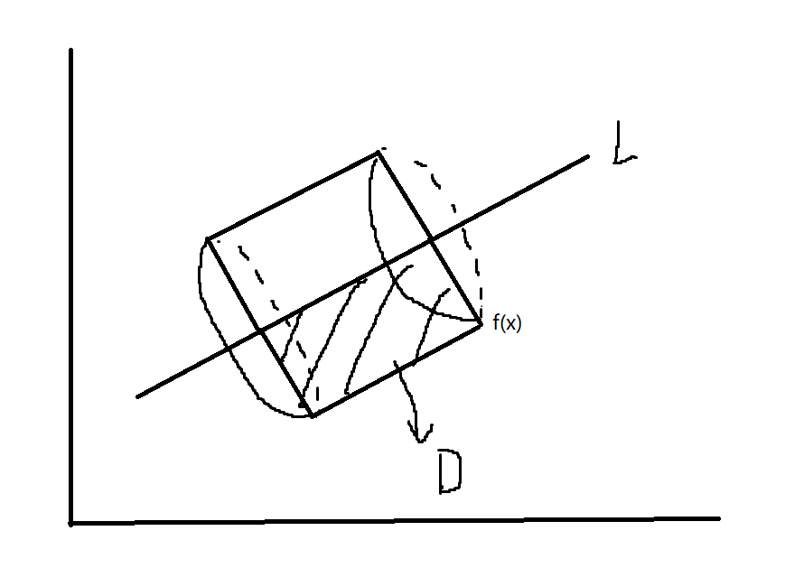
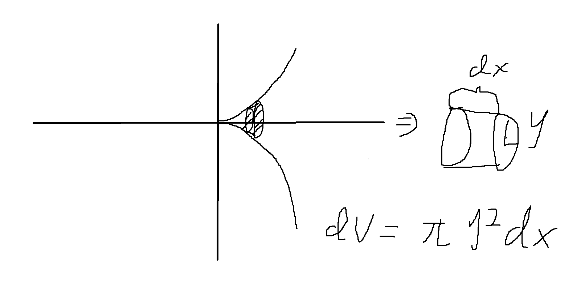
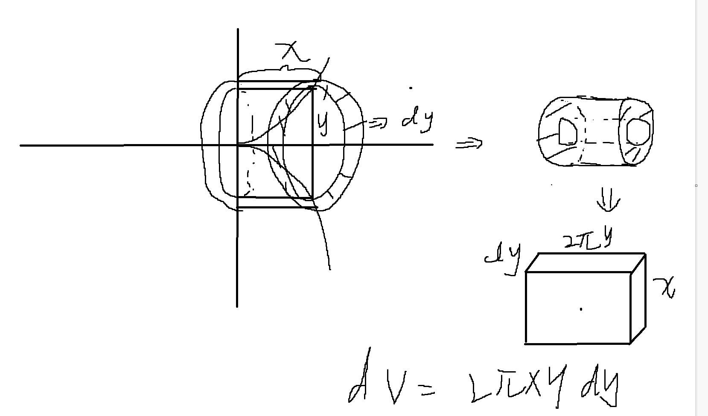

## 旋转体体积

---
### 1.通用公式
设 $f(x)$ 是在 $[a,b]$ 上连续可积可导的函数,设直线 $L_0 : Ax + By +C = 0$ ,**且过 $L_0$ 的所有垂线与 $f(x)$ 至多有一个交点**,则平面图形 $D={(x,y)|,a\leq x \leq b , f(x)\leq y \leq L}$ 那么当 $D$ 绕 $L_0$ 旋转后得到一个旋转体,那么该旋转体的体积为:

$$\begin{align}
    V = \frac{\pi}{(A^2 + B^2)^{\frac{3}{2}}}\int^b_a \{Ax + Bf(x)  + C \}^2 |Af'(x) - B| dx
\end{align}$$

口诀 $AB,ABC,AB$.仅用于曲线和旋转轴之间的体积,例如:
1.绕x轴旋转 ==> 得到曲线旋转后与x轴所围成的体积,不能得到曲线旋转后与y轴所围成的体积(圆环类型)
2.绕y轴旋转 ==> 得到曲线旋转后与y轴所围成的体积,不能得到曲线旋转后与x轴所围成的体积(圆环类型)

---
## 2.绕x轴旋转
### 2.1 曲线与x轴之间的体积
$y = 0 \rightarrow  A = 0,B = 1,C = 0$ ,则可以得到旋转体体积:

$$\begin{align}
    V = \pi\int^b_a f(x)^2 dx
\end{align}$$
硬币类型.

### 2.2 曲线与y轴之间的体积
$x = 0\rightarrow A = 0 , B = 0,C = 0$

$$\begin{align}
    V = 2\pi \int^b_a  xy dy
\end{align}$$

如果 $f'(x) >0 $ ,则有:

$$\begin{align}
    V = 2\pi \int^b_a xy |f'(x)| dx
\end{align}$$

圆环类型.

---
## 3.绕y轴旋转
### 3.1 曲线和x轴之间的体积
设平面曲边梯形 $D = \{(x,y)|0\leq y \leq f(x),0\leq a \leq x \leq b \}$,且 $f(x)$ 连续,则可以得到 $D$ 绕y轴旋转一周后他与x轴缩夹所得旋转体体积:

$$\begin{align}
    V &= 2\pi\int^b_a x |f(x)| dx
\end{align}$$

圆环类型.

### 3.1 曲线和y轴之间的体积
设平面曲边梯形 $D = \{(x,y)|0\leq y \leq f(x),0\leq a \leq x \leq b \}$,且 $f(x)$ 连续,则可以得到 $D$ 绕y轴旋转一周所得旋转体体积:

$$\begin{align}
    V = \pi \int^b_a  x^2 dy = \pi \int^b_a  x^2 f'(x) dx
\end{align}$$

硬币类型.

## 4.平面图形
平面图形 $D = \{(r,\theta)| 0\leq r \leq r(\theta) , \theta \in[\alpha,\beta] \subset [0,\pi] \}$ ,则 $D$ 绕极轴(即x轴)旋转后的旋转体积为:

$$\begin{align}
    V = \frac{2\pi}{3}\int^\beta_\alpha r^3(\theta)sin\theta d\theta
\end{align}$$

