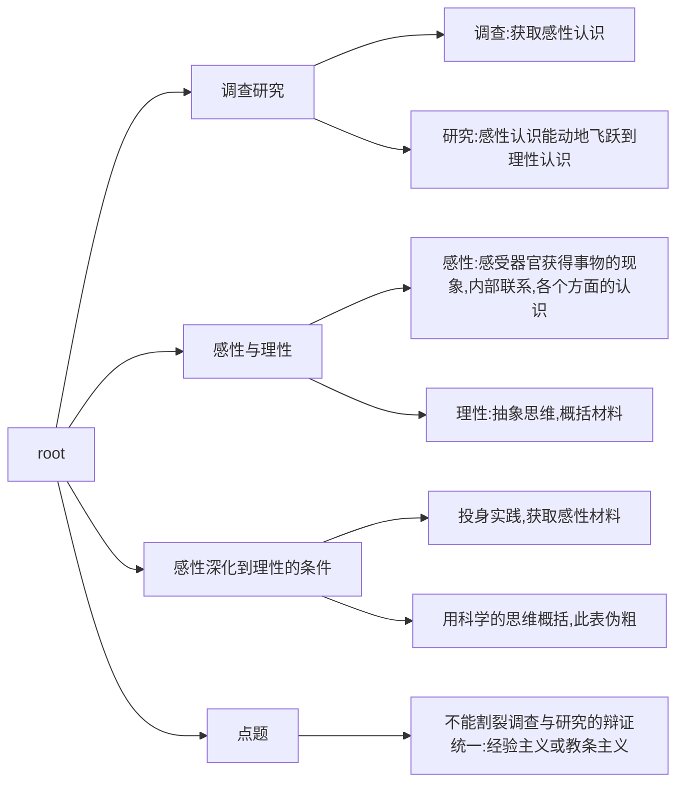
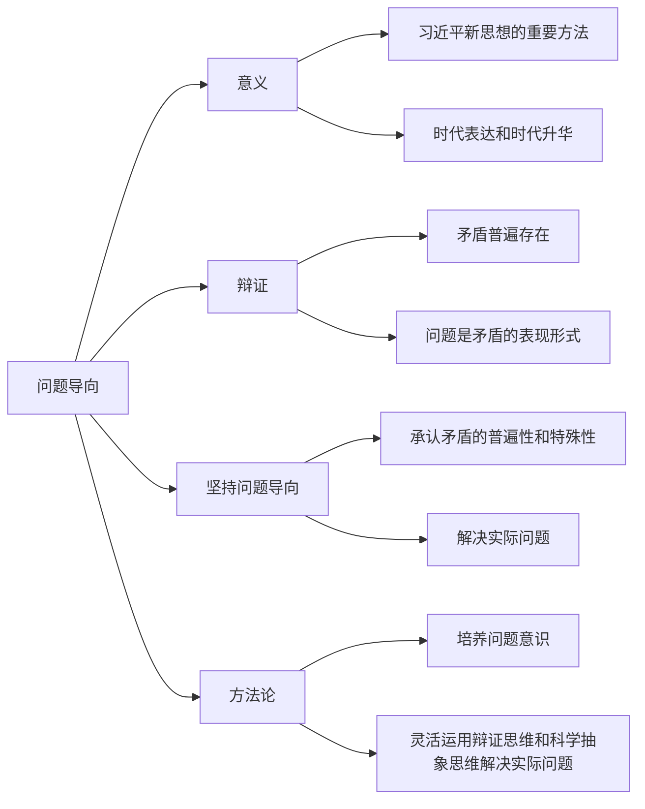
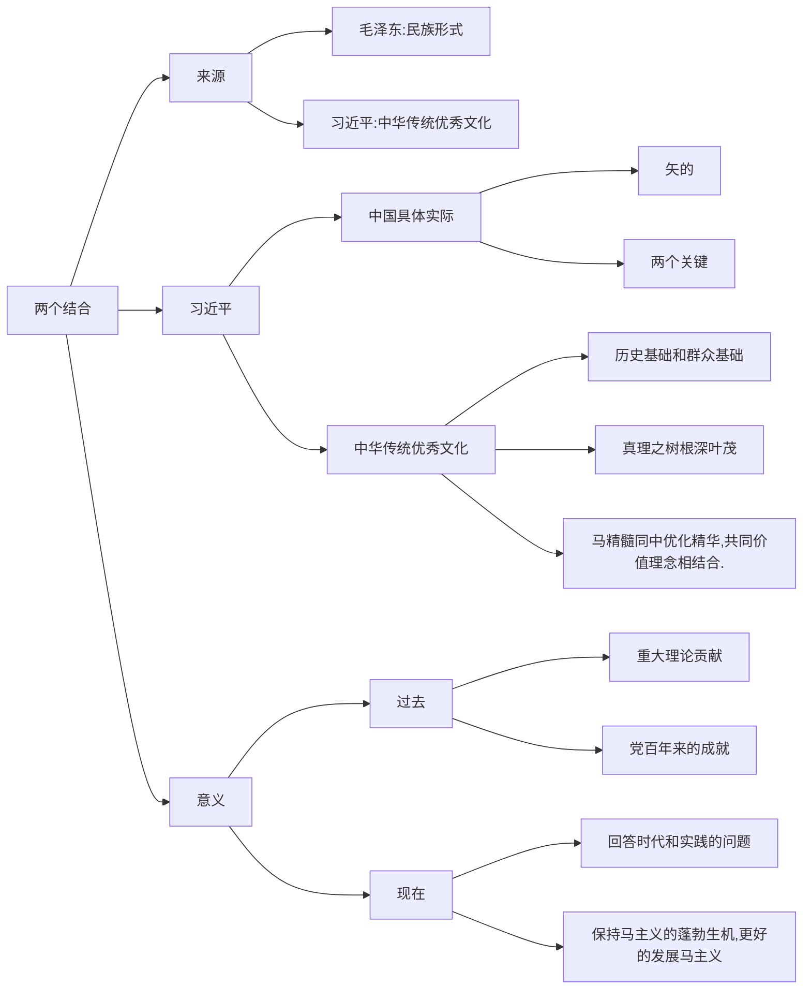
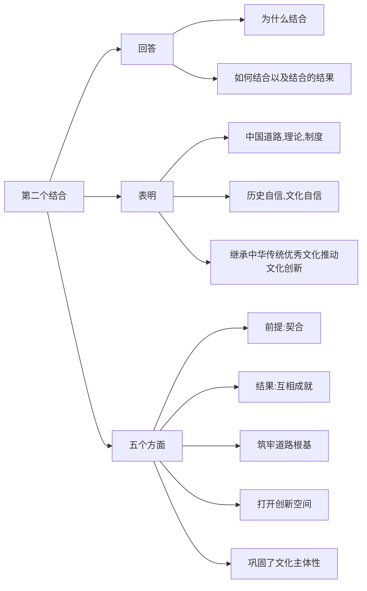
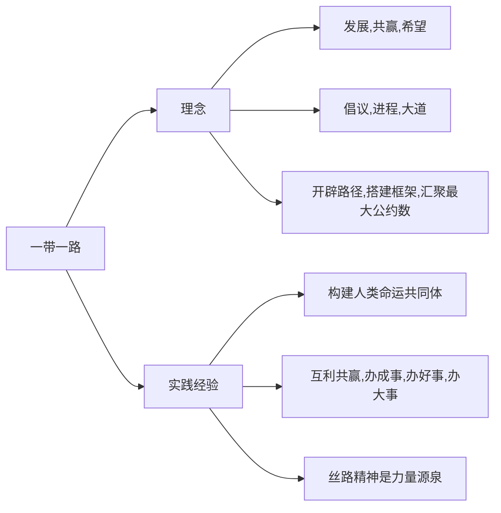
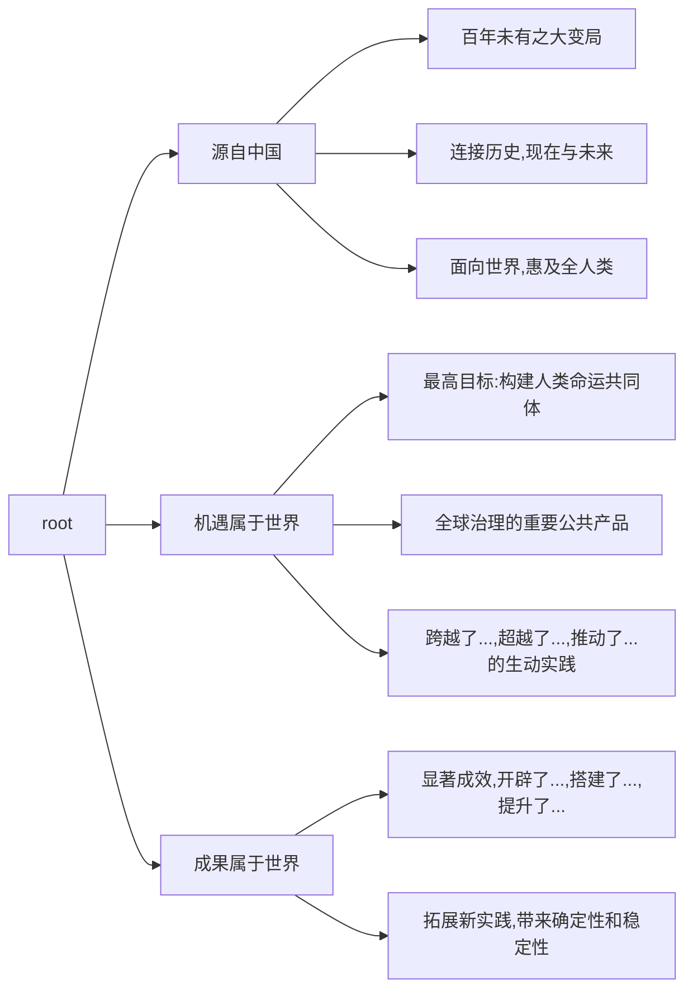

### 34题
(1)调查研究
a.调查研究
b.感性与理性认识的定义
c.感性与理性认识的关系
d.如何深化

(2)问题导向
a.意义:重大理论方法,唯物主义矛盾观点和矛盾分析方法的时代表达和时代升华
b.问题
c.问题导向与矛盾
d.如何运用
(3)群众
a.主体,创造者
b.方向,结果
c.精神,物质,变革

d.坚持马理论,贯通群众观点

### 35题
(1)两个结合的介绍
a.由来
* 毛泽东-民族表示
* 习近平-中国传统优秀文化

b.习近平-第二个结合
* 中国实际
  * 马"矢" -> 中 "的"
  * 中国实际和时代特征
* 中国传统优秀文化
  * 历史基础和群众基础
  * 根深叶茂
  * 契合,扎根
* 意义
  * 过去:重大理论贡献,党百年来的重大成果
  * 将来:坚持两个结合,回答重大问题,推进马理论中国化,维持马理论的蓬勃生机.

(2)
a.回答为什么,如何,结果
b.达到了党对中国道路,理论,制度新高度,文化历史自信,文化创新的新高度.
c.前提,结果,筑牢,打开,巩固.

### 36
(1) 共产党的重任
a.悲惨历史
b.不同救国方案
* 洋务派-"中学为体,西学为用"
* 戊戌派-改良图强
* 孙中山资产阶级派-资产阶级民主

c.四个时期
* 新民主主义事情
* 社会主义革命和建设时期
* 改革开放和社会主义现代化建设时期
* 新时代中国现代化

(2) 现代化的阐述
a.特点.
b.实践上是强国建设,民族复兴的正确道路.
c.吸收一切优秀成果,全新的人类文明形态.
d.打破了"现代化=西方化",给发展中国家的道路
e.重大创新

### 37
(1)理想信念
a.志向与立志
b.理想与信念
c.理想信念的特征
d.实现理想是一个曲折的过程,需要脚踏实地,持之以恒的奋斗.

(2)理想实现
a.理想实现是一个过程,他的实现过程越复杂,所花费的时间越长
b.理想不是轻而易举的,必然遭受各种各样的曲折和磨难,要用于接收挑战,直视困难.
c.顺境和逆境是人生历程中两种不同的状态,具有两面性,主要在于如何去看待它.

(3)青年人的方法
a.树立艰苦奋斗
b.选择吃苦奉献
c.梳理崇高的职业理想
d.幸福生活由劳动创造

### 38
(1)

(2)

