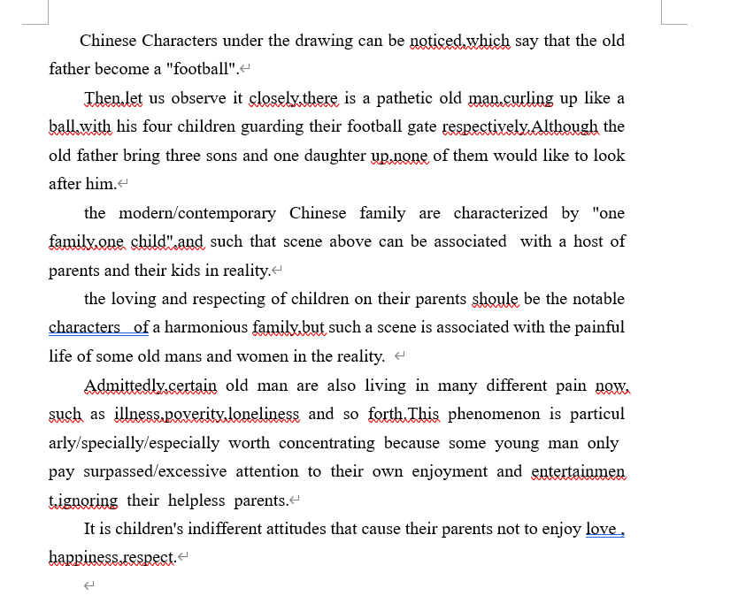

### 1.审题三事项
* 英文指令
* 图画信息
* 文字说明

图画信息和文字说明要结合.

### 2.作文思路
首段:图画描述
中间段:阐述寓意(2~3段)
尾段:评论展望

### 3.图画描述
* 画的个数
These are/is two/one simple but enlighting(satirical) drawings/drawing.
* 六种手法:
(1)介词短语表环境(inside(in) a ...)
(2)there be 引出人物
(3)v-ing 表伴随的动作
(4)with + n. + v-ing/v-ed / 表身上或者周围的事物.
(5)althought 引导让步状语表反常
(6)被动句 + 定从:文字说明

总结下来有:
先说明图文环境,再引出人物,说明他们在做的事情,再说明他们的周围的事物,再对反常的事物进行阐述,最后利用被动句来将图文的文字说明表述起来.

例如:
in the confront of the computer, there is a kind teacher,speaking and teaching knowledge,with the a sweet smiling on his face.

Althought his faculty of playing game is so bad,his capability of studing is incredible great,with his grade reaching 150 score in this test.

### 4.图画联系现实
从图文中描述联系现实的内容.
* The modern/contemporary ... are characterized by ...
* and such a scene could be associated with ... in the reality.

### 5.现象
Admittedly,....
this phenomenon is particularly woring 

### 6.替换
|单词|替换|
|---|---|
|drawing|picure,cartoon|
|ironic|satirical|
|scene|phenomenon|

### 7.短语
|短语|意思|
|---|---|
|this sth is particularly worth doing.|某物值得做...|
|bear in mind|牢记|

### 8.例文
范文:
Chinese Characters under the drawing can be noticed,which say that the old father become a "football".
Then,let us observe it closely,there is a pathetic old man,curling up like a ball,with his four children guarding their football gate respectively.Although the old father bring three sons and one daughter up,none of them would like to look after him.
the modern/contemporary Chinese family are characterized by "one family,one child",and such that scene above can be associated  with a host of parents and their kids in reality.
the loving and respecting of children on their parents shoule be the notable characters  of a harmonious family,but such a scene is associated with the painful life of some old mans and women in the reality. 
Admittedly,certain old man are also living in many different pain now,such as illness,poverity,loneliness and so forth.This phenomenon is particularly/specially/especially worth concentrating because some young man only pay surpassed/excessive attention to their own enjoyment and entertainment,ignoring their helpless parents.
It is children's indifferent attitudes that cause their parents not to enjoy love , happiness,respect.However,children's love and care ,can bring the parents warm,inspiring their enthusiasm about the life and help them enjoy their the twilight/happy time.Unfortunately,the indifferent of some children has constitued an obstacle that hamper the harmonious family.
Hence,the society as a whold should foster a postive environment to love,care and protect the parents.Furthermore,it is necessary for the adult children to take more time to accompany with their parents.

照写:
There is a simple but ironic picure. In the center of the football ground,there is a old  and infirm man,lying and cryying,with his four children defending in those own football gate respectively.Although the old man rear the four children in his life,his children are not willing to rear him.
it is parents' overprotection that causes young people to build up inadequate competence or faculty to face the society.
However,indenpendence, from my point of view / to my understanding,can be likened to journey leading to success .As a significant quality,indenpendence may bring teenagers brave,arouse/inspire/evoke thir enthusiasm/passion/love/zeal for life and help them win in the future social competation.Unfortunately,the parents' too much love,have constitued the obstacle that hamper their children life.
Hence,the society as a whole should foster a postive atmosphere to criticize  parents' blind/irrational love.
或者
Furthermore,it is advisable for parents to offer their children freedom and opportunities to grow indenpendently.
To conclude,all parents should bear in mind that they cannot protect their in all life time.

