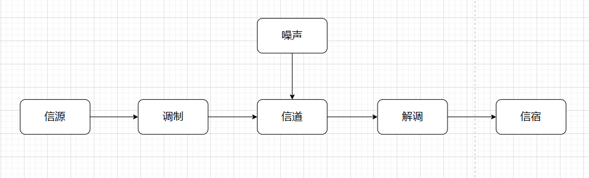
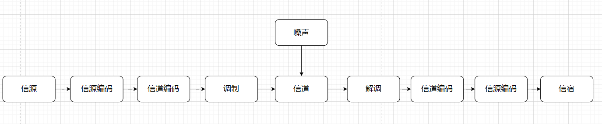

### 1.系统
#### 1.1 模拟信号调制系统

#### 1.2 数字信号调制系统

#### 1.3 系统分类
按照工作方式可以分为单工系统、半双工系统、全双工系统

### 2.信道
#### 2.1 有线信道
有线信道的信号是导向传输，传输的介质主要有双绞线、同轴光缆、光纤。

#### 2.2 无线信道
无线信道主要通过电磁波传输，常用方式主要包括地波传输、天波传输、天线传输。

### 3.信息
#### 3.1 信息量
设存在有限可重复元素的集合 $A \in R$ ,其中概率映射 $P : A \rightarrow [0,1]$ ,对于消息 $x \in A$ ,它的信息量被定义为
$$\begin{align}
    I = \log_a \frac{1}{P(x)} = - \log_a P(x)
\end{align}$$

其中映射 $P$ 被定义为
$$\begin{align}
    P(x) = \frac{Num(x)}{Num(A)}
\end{align}$$

信息量大小通常与底数 $a$ 有关， $a=2$ 时 $I$ 的单位为比特 $a = e$ 时 $I$ 的单位为，奈特 $a = 10$ 时，$I$ 的单位为 哈特莱。

#### 3.2 熵
信源发出的信息有多种，计算所有信息的统计平均量，将其称为熵。设集合 $A$ 的不同元素有 $N$ 个 $x_1,x_2,\cdots x_N$,则熵可以被计算为
$$\begin{align}
    H(A) &= \sum_{n=1}^N P(x_n)\log_a \frac{1}{P(x_n)} \\
    &=-\sum_{n=1}^N P(x_n)\log_a P(x_n)
\end{align}$$

### 4.性能指标
#### 4.1 数字信号系统性能指标
##### 4.1.1 有效性
###### a.码元速率
一个码元(符号)由多个比特组成,每秒传输比特的个数就成为信息传输速率( $R_b(bit/s)$ ),每秒传输码元的个数就称为码元传输速率( $R_B(Baud/s)$ )。
如果信源的熵为 $H(A)$ ，则码元速率和信息速率的关系为
$$\begin{align}
    R_b = R_BH(A)
\end{align}$$

如果信源的消息类型有 $M$ 种，则码元速率和信息速率的关系为
$$\begin{align}
    R_b = R_B \log_2M
\end{align}$$

###### b.频带利用率
频带利用率是信息传输速率与带宽的比例
$$\begin{align}
    \eta = \frac{R_b}{B}
\end{align}$$

##### 4.1.2 可靠性
###### a.误符号率(SER)
$$\begin{align}
    P_s = \frac{error(B)}{Num(B)}    
\end{align}$$

###### b.误比特率(BER)
$$\begin{align}
    P_b = \frac{error(b)}{Num(b)}    
\end{align}$$

#### 4.2 模拟信号系统性能指标
##### 4.2.1 有效性
模拟信号系统的有效性由传输带宽衡量。
##### 4.2.2 可靠性
模拟信号系统的可靠性由信噪比衡量。信噪比( $SNR$ )公式为
$$\begin{align}
    SNR = 10\log_{10} \frac{S}{N}
\end{align}$$

其中 $S$ 为信号功率, $N$ 为噪声功率。

### 5.香农公式
信道中的噪声通常被模拟为加性白噪声( $AWGN$ )，当 $AWGN$ 信道的带宽为 $B(Hz)$ ，信号功率为 $S(W)$，噪声功率为 $N(W)$ 时，信道的容量为 
$$\begin{align}
    C = B\log_2(1 + \frac{S}{N})
\end{align}$$

注意:
* 任何一个信道，都有信道容量。
* $\frac{S}{N}$ 是信噪比，信噪比越大，容量越大。
* 信噪比和信道带宽可以调整来获取较合适的信道容量。
* 无限增大信道带宽时并不能使信道容量增大，采用极限形式求解

$$\begin{align}
    \lim_{B \rightarrow \infty} C &= \lim_{B \rightarrow \infty} B\log_2(1 + \frac{S}{N}) \\
    &=\lim_{B \rightarrow \infty} B\log_2(1 + \frac{S}{N_0B}) \\
    &= \lim_{B \rightarrow \infty} B\frac{\ln (1 + \frac{S}{N_0B})}{\ln 2} \\
    &=\lim_{B \rightarrow \infty} \frac{B \times \frac{S}{N_0B}}{\ln 2} \\
    &=\frac{1}{\ln 2} \times \frac{S}{N_0} \\
    & \approx 1.44 \frac{S}{N_0}
\end{align}$$

### 6.例题
【例1.3】已知彩色电视图像由 $5 \times 10^5$个像素组成。设每个像素有 $64$ 种彩色度，每种彩色度有 $16$ 个亮度等级。假设所有彩色度和亮度等级的组合机会均等，像素间统计独立，画面间也相互独立。(1)试计算每秒传送 $25$ 个画面所需的信道容量;(2)如果接收机信噪比为 $30dB$ ，为了传送彩色图像所需信道带宽为多少?
解:
(1) 单个像素的比特为
$$\begin{align}
    I_s &= \log_2 (64 \times 16) \\
    &= 6 +  4 \\
    &= 10(bit)
\end{align}$$

所有像素的信息量为
$$\begin{align}
    I = 5 \times 10^6
\end{align}$$

如果每秒传输 $25$ 个画面，则总的信息量为
$$\begin{align}
    I_{sum} = 125 \times 10^6
\end{align}$$

那么信道容量就要满足
$$\begin{align}
    C \geq 1.25 \times 10^8
\end{align}$$

(2) 信噪比为 $30dB$ ,则
$$\begin{align}
    10\log_{10} \frac{S}{N} = 30 \rightarrow \frac{S}{N} = 10^3
\end{align}$$

那么
$$\begin{align}
    C &= B\log_2 (1 + \frac{S}{N}) \geq 1.25 \times 10^8\\
    &= B \log_2(1 + 10^3) \geq 1.25 \times 10^8
\end{align}$$

得到
$$\begin{align}
    B \geq \frac{1.25 \times 10^8}{\log_2(1 + 10^3)} \approx 1.254 \times 10^7 Hz
\end{align}$$